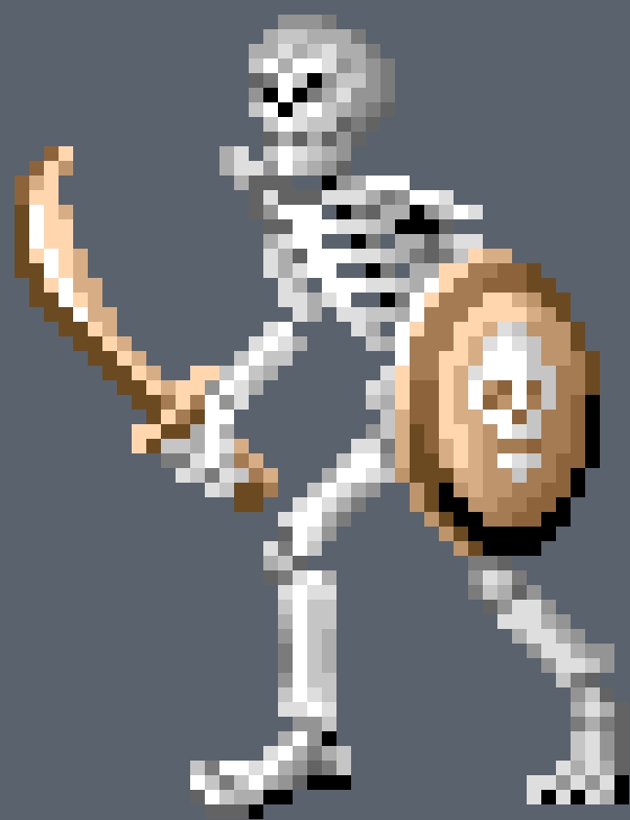

# GTVimageVect
Source code of "Geometric Total Variation for Image Vectorization, Zooming and Pixel Art Depixelizing" authored by  Bertrand Kerautret and Jacques-Oliver Lachaud (2019)

You can also access to [IPOL](http://www.ipol.im) online demonstration [here](https://ipolcore.ipol.im/demo/clientApp/demo.html?id=77777000076)

Build status:
 - Linux/MacOS 
 - Windows 

## Installation

To use this source code, you need to install the following dependencies:
   - **DGTal library** (current version or at least [commit 0e13036](https://github.com/DGtal-team/DGtal/commit/0e13036afedee920373a2460afd02e2a21660baa)), on Linux/Mac just follow these steps:
     - Install (if not already present), the boost dependancies (see https://www.boost.org).
     For instance on linux you can install the following package: sudo apt-get install `libboost-dev libboost-system-dev libboost-program-options-dev`(the `libboost-program-options-dev` is not mandatory for DGtal but is used by our project)
     - `git clone git@github.com:DGtal-team/DGtal.git`
     - `cd DGtal; mkdir build; cd build`
     - `cmake .. -DBUILD_TESTING=OFF -DBUILD_EXAMPLES=OFF -DCMAKE_BUILD_TYPE:string="Release";`
     - `make;` eventually:  `make install`.

     For any problem, don't hesitate to contact the DGtal team on the [GitHub repository](https://github.com/DGtal-team/DGtal).
     On windows or more details see instructions [here](https://dgtal-team.github.io/doc-nightly/moduleBuildDGtal.html).
   - **cairo**
      On *Linux*, the installation can be done from a package mananger (see [here](https://www.cairographics.org/download/) for more details.
      On *Windows*, you can follow the steps of the cairo website or run the script or upload the binary from the [cairo-windows](https://github.com/preshing/cairo-windows) repository. You can also consult the appveyor configuration file ([appveyor.yml](https://github.com/kerautret/GTVimageVect/blob/master/appveyor.yml)) that uses it.
   - **boost programm options** by default the application use the package `libboost-program-options-dev`. You can use you default package manager to install it.

The installation of the code can be done by following these steps:
   - Download the source for instance by using the `git` command:
     - `git clone git@github.com:kerautret/GTVimageVect.git`
     - `cd GTVimageVect; mkdir build; cd build;`

   - Then, you can start to build the code: (you can remove the DGtal path if you make a global installation of DGtal).
     - `cmake .. -DDGtal_DIR="/fullpath_to_yourParent_DGtal_dir/DGtal/build" -DCMAKE_BUILD_TYPE:string="Release"`
     - `make`
     
## Typical Use
   The algorithm is run from executable `tv-triangulation-color`. For instance, you can use as follows (from the project directory):
   
   `./build/bin/tv-triangulation-color -i Input/dolphin.ppm -b 16 -D 16 -o output -C result.svg`
   
   Then you should obtain:
    <table>
    <tr><td></td>
    <td>
     </td><td></td>
    </tr>
 <tr> <td> source image (<a href="https://user-images.githubusercontent.com/772865/62563570-931eb300-b883-11e9-8ee6-c6054d60040a.png">.png</a>)</td> <td>result (scaled bitmap <a href="https://user-images.githubusercontent.com/772865/62563720-e85ac480-b883-11e9-982c-01e3dedc316b.png">.png</a>)</td><td>result (vectorial format <a href="tests/ex_results/result.svg">.svg</a>)</td> </tr>
</table>
                                           
The vectorial representation allows you to edit easely the shape by using for instance <a href="https://inkscape.org">inskape</a>. First you can generate the vectorial representation:
 
` ./build/bin/tv-triangulation-color -i tests/ex_results/skeleton.ppm -b 16 -D 16 -C skeleton.svg`

Then after edition you can obtain for instance the representation belwo on right image:
<table>
 <tr><td></td>
  <td></td>
<td>
</td>
</tr>
<tr>
 <td>source (scaled)</td> 
 <td>result (svg)</td>
 <td> Edited using <a href="https://inkscape.org">inskape</a> and animated from svg format</td>
</tr>
 </table>
 

The algorithm can be used to zoom on part of photography:

`./build/bin/tv-triangulation-color -i Input/ara.ppm -b 16 -D 16 -output resultAra`

You should obtain such resulting images:

<table>
<tr></tr>
<td> </td>
<td> </td>
<td> </td>

</table>

## Reproduction of Paper Figures
All the figures of the paper using the present algorihtms can be reproduced from the following script `script-figures.sh`.
You just have to run by specifying the Input/Output directory:

 `mkidr Output`
 
 `script-figures.sh Input Output`
 
 The comparisons with existing algorithms can be applied onlne with the following demonstrations:
   - Convolutional Neural Network for Subpixel Super-Resolution [22]: [online demo](https://ipolcore.ipol.im/demo/clientApp/demo.html?id=77777000078).
   - Super resolution with HQx Algorithm [23]: [online demo](https://ipolcore.ipol.im/demo/clientApp/demo.html?id=77777000079)
   - Image Interpolation with Geometric Contour Stencils [7]: [online demo](http://demo.ipol.im/demo/g_interpolation_geometric_contour_stencils).
  - Vector-valued image interpolation by an anisotropic diffusion-projection PDE [19]: [online demo](http://demo.ipol.im/demo/g_roussos_diffusion_interpolation/).
  - Vector Magic Inc [10]: [online demo](http://vectormagic.com).
  - Depixelizing [13] and Potrace [21] were produced by using  [Inskape](https://inkscape.org/fr/) with the default parameters.
 

